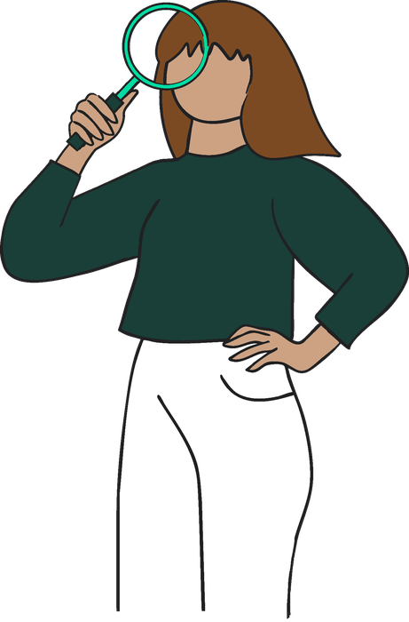

# The Innovation Model

<div class="pb-banner pb-c-win" markdown>
<div class="pb-banner-text" markdown>
<span class="pb-banner-kicker">For regions, cities, states, and economic development partners</span>

**Built here. Stays here. Hack Your Region in six steps.**
</div>

</div>

The Innovation Model is based on **Hack Michigan**: a regional hackathon where industry partners bring real AI challenges, teams build working prototypes over 48 hours, and the winners take a bigger stage days later. The goal is to keep talent, ideas, and opportunity in your region.

## Hack Your Region

Name your event for your place: **Hack [Your Region]**. A city, a state, or a wider region all work: *Hack Ohio*, *Hack Atlanta*, *Hack Chicago*, *Hack the Great Lakes*. The name tells people exactly who it's for.

!!! note "Naming and credit"
    Call your event anything you like. We only ask that you add this credit line to your website or event page:

    ```text
    Based on Hack Michigan: https://the-better-hackathon.github.io/playbook/innovation/
    ```

## Your path

<ol class="pb-flow pb-flow-6" markdown>
<li class="pb-c-win" markdown="span">**[Rally your region's partners](partners.md)**</li>
<li class="pb-c-win" markdown="span">**[Co-create industry challenges](challenges.md)**</li>
<li class="pb-c-win" markdown="span">**[Choose your format](format.md)**</li>
<li class="pb-c-win" markdown="span">**[Host the event](host.md)**</li>
<li class="pb-c-win" markdown="span">**[Winners take the stage](stage.md)**</li>
<li class="pb-c-win" markdown="span">**[Report outcomes](outcomes.md)**</li>
</ol>

Each step is one short page. Use the **Next** button at the bottom of each page.

## What makes it the Innovation Model

- **Industry challenges, co-created.** Partners bring real business problems. The organizer writes the briefs, with the solution left to the teams.
- **Outcomes, not specifications.** Every challenge ends with one test judges apply to every demo.
- **Regional impact is judged.** Teams show how their work keeps value, jobs, and opportunity in the region.
- **Winners take a bigger stage,** like a tech week or a regional conference.
- **Results are reported.** Partners get prototypes, talent, and a report they can act on.

## In practice: Hack Michigan 2026

Teams built for challenges from DTE Energy, StartMidwest, and The AI Collective Detroit, over three days at TechTown Detroit. The winners presented at Michigan Tech Week. See the [challenges](../challenges/index.md#hack-michigan-2026-challenges) and the [winners](../run/after.md#hack-michigan-2026-winners).
