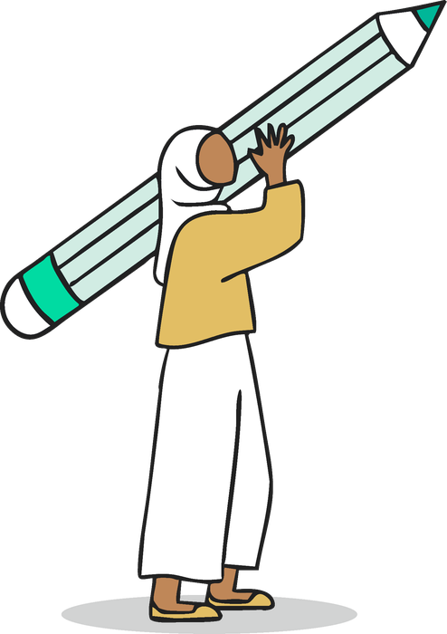

# Event Models

For organizers

**Ready-made models you can run in your own community, each in six short steps.**

Each model is a complete path you can follow and adapt. Name your event anything you like, and [credit the playbook](../library/credit.md).

| Model | What it is | Start here |
|---|---|---|
| **Challenge-led (Hack Michigan)** | Partners bring real industry problems; teams build working prototypes | [Organize track](../organize/index.md) |
| **AfroHacks** | Build a project or contribute to open source, for Black technologists in communities, universities, and HBCUs | [Run an AfroHacks](../afrohacks/index.md) |
| **Open source hackathon** | Build with, contribute to, and improve open source technologies, models, and tools | [Run an open source hackathon](../open-source/index.md) |
| **Pop-up hack day** | A free community meetup in a public space; bring your own project | [Pop-up hack day](../run/formats/pop-up.md) |

Any model can add tracks such as capture the flag, a bug bash, or a design sprint. See [Track options](../run/tracks.md).
