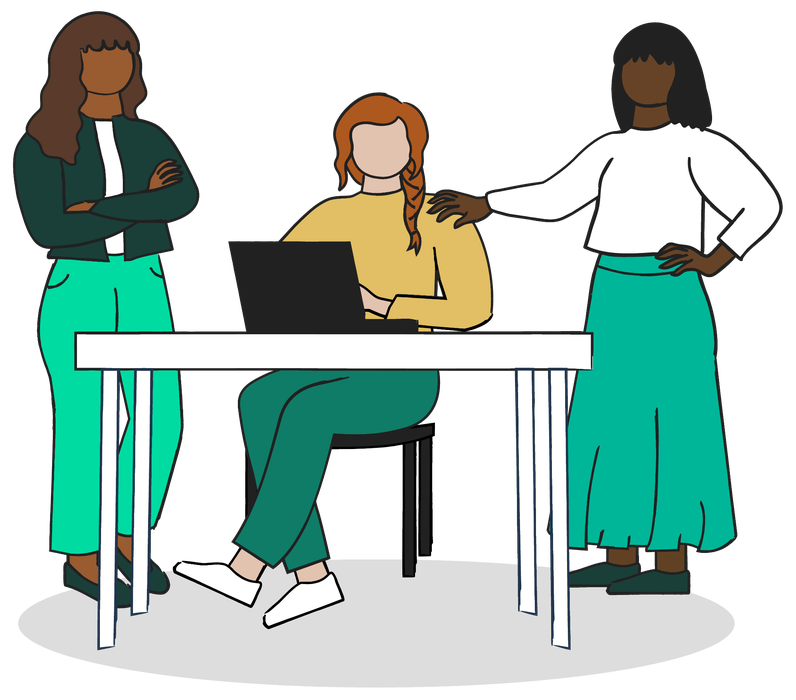

# Organize a Hackathon

For community organizers

**Seven steps, one at a time, from choosing a format to celebrating the winners.**

This track walks you through organizing a challenge-led hackathon or a community pop-up. Each step is one short page: what to do, where to go deeper, and how to know you're ready for the next one. Use the **Next** button at the bottom of each page.

## Your path

<ol class="pb-flow pb-flow-7" markdown>
<li class="pb-c-run" markdown="span">**[Choose your format](format.md)**</li>
<li class="pb-c-run" markdown="span">**[Decide how people take part](participation.md)**</li>
<li class="pb-c-run" markdown="span">**[Bring in partners](partners.md)**</li>
<li class="pb-c-run" markdown="span">**[Design the experience](experience.md)**</li>
<li class="pb-c-run" markdown="span">**[Prepare](prepare.md)**</li>
<li class="pb-c-run" markdown="span">**[Host the day](host.md)**</li>
<li class="pb-c-run" markdown="span">**[Follow up and celebrate](follow-up.md)**</li>
</ol>

## Timeline

| When | Steps |
|---|---|
| 8 to 12 weeks out | 1, 2, and 3: format, participation, partners |
| 6 to 8 weeks out | 3 and 4: challenge briefs, experience plan |
| 4 to 6 weeks out | 5: publish challenges, rules, and registration |
| 1 to 2 weeks out | 5: send the hackathon guide, provision accounts |
| Event | 6: host the day |
| Following weeks | 7: follow up and celebrate |

A [pop-up](../run/formats/pop-up.md) needs far less: pick a place and a date two to four weeks out, then skip straight to steps 4 and 6.

## Principles to keep in mind

1. **People first.** Every touchpoint matters, from the website to the follow-up email.
2. **Real challenges, not vague themes.** Partners bring the problem; teams invent the solution.
3. **Coach every team,** so first-timers get the same start as veterans.
4. **Protect the finish:** code freeze, time to prepare, practice before judging.
5. **The work keeps going** after the event.
