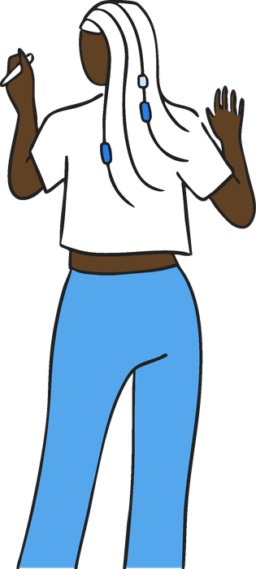

# Partner With Us

For companies, startups, universities, foundations, and partners

**Five steps from a real problem to working prototypes, talent, and partnerships.**

A challenge-led hackathon gives your organization something most sponsorships don't: dozens of people working on **your** problem, in the open, for a weekend. You leave with working prototypes, new ideas, and relationships with the people who built them.

## Your path

Each step is one short page. Use the **Next** button at the bottom of each page.

<ol class="pb-flow pb-flow-5" markdown>
<li class="pb-c-partner" markdown="span">**[Choose how you'll take part](ways-to-partner.md)**</li>
<li class="pb-c-partner" markdown="span">**[Shape your challenge](shape-your-challenge.md)**</li>
<li class="pb-c-partner" markdown="span">**[Show up for the teams](event-day.md)**</li>
<li class="pb-c-partner" markdown="span">**[Follow up](follow-up.md)**</li>
<li class="pb-c-partner" markdown="span">**[Measure outcomes](outcomes.md)**</li>
</ol>

## Why bring a challenge

=== "Builders and students"

    Developers, designers, researchers, and students get real industry problems to work on, mentors and tools, and a public write-up and demo for their portfolio.

=== "Community organizations"

    Community organizers, tech communities, and nonprofits bring their community's real needs to people who can build for them, and get a repeatable model for running their own events.

=== "Universities"

    Give students applied, industry-connected projects with portfolio-ready outcomes, and build relationships with employers and community partners.

=== "Startups"

    Put your API, product, or data in front of builders. Get feedback, early users, and potential collaborators or hires.

=== "Accelerators and investors"

    See new teams and ideas early, meet founders building in your region, and bring a challenge that reflects what your portfolio companies need.

=== "Technology partners"

    Get your platform used on real problems, learn how builders combine it with other tools, and grow a community of developers who know it.

=== "Enterprise and industry"

    Explore a real business problem at low cost and low risk. See several approaches side by side, and meet builders who already understand your domain.

=== "Foundations and public sector"

    Foundations, government, and economic development organizations surface practical solutions to community and economic challenges, with measurable outcomes to report.

## What you get back

- **Working prototypes** built against your challenge, with public write-ups and demos
- **Different approaches** to the same problem, side by side
- **Talent:** direct contact with the developers, designers, and researchers who built them
- **Qualified connections** from a registration list with role and organization
- **Visibility:** your challenge, your brand, and your winners on stage
- **A next step,** if you want one: a pilot conversation, an internship, or a follow-up project

See how to [measure and report outcomes](outcomes.md).

## Examples

| Partner | Challenge | The test teams built toward |
|---|---|---|
| DTE Energy | [Utility Pole Risk Profiling](../challenges/examples/dte-energy.md) | Could a maintenance planner change next week's schedule based on your tool? |
| StartMidwest | [Innovation Ecosystem Discovery](../challenges/examples/startmidwest.md) | Does a founder get to "wait, that exists?" |
| The AI Collective Detroit | [Small Business AI Adoption](../challenges/examples/ai-collective.md) | Can an owner with no tech team have it running within a month, for under $50? |

## Questions partners ask

??? question "Can we run one just for our own organization?"
    Yes. A one-day [hack day](../run/formats/hack-day.md) works well for internal teams, partner ecosystems, and customer communities.

??? question "How much time does it take?"
    About two hours of planning before the event, plus whatever time you spend at it. See the timeline above.

## Which format fits

| If you want… | Choose |
|---|---|
| An internal or partner hack day, or an add-on to a conference | [Hack day (12 hours)](../run/formats/hack-day.md) |
| A track at a university or community hackathon | [24 hours (2 days)](../run/formats/24-hour.md) |
| Deep work on a hard, data-heavy challenge | [48 hours (3 days)](../run/formats/48-hour.md) |
